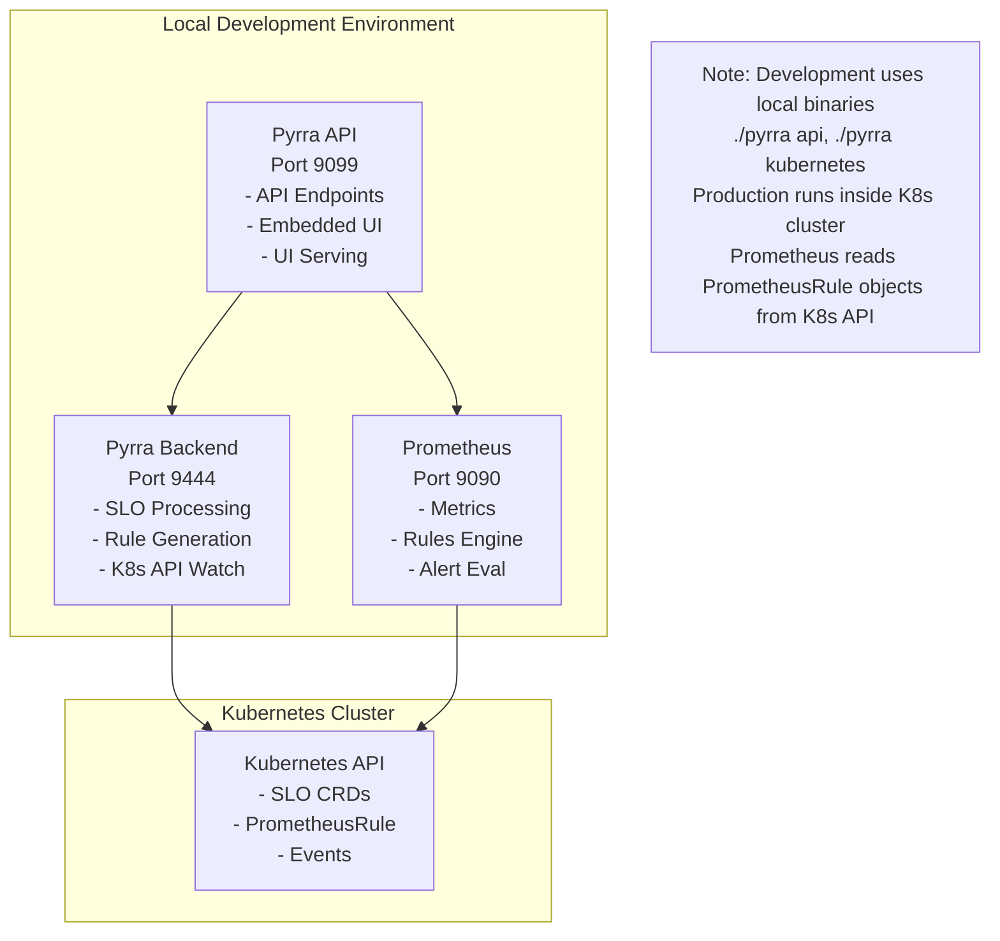
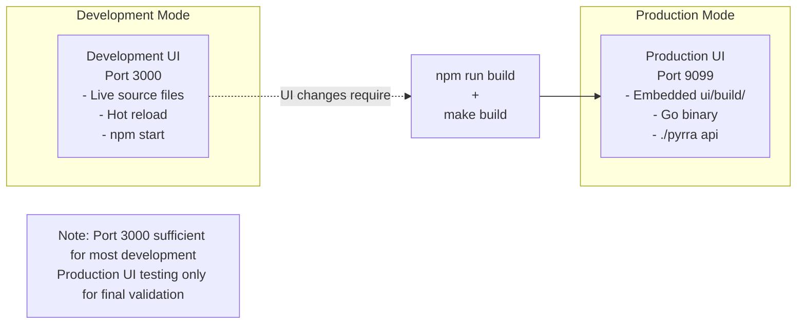

# Dynamic Burn Rate Feature Completion - Design Document

## Overview

This design document outlines the completion of the dynamic burn rate feature for Pyrra, focusing on comprehensive validation across all indicator types, enhanced user experience, and production readiness. The feature is approximately 30% complete with backend implementation finished and basic UI functionality working for ratio indicators.

**Critical Architectural Understanding**: Dynamic burn rates modify **alert threshold calculations only**. Error budget calculations remain identical between static and dynamic burn rates using the standard SLO formula: `((1-SLO_target)-(1-success/total))/(1-SLO_target)`. The innovation is in traffic-aware alert sensitivity, not error budget computation.

The design leverages the comprehensive testing framework and quality standards already established in the project, organizing the remaining work into focused implementation tasks.

## Architecture

### Current Implementation Status

#### Completed Components ✅
- **Backend Implementation**: Complete for all indicator types (Ratio, Latency, LatencyNative, BoolGauge)
- **Mathematical Foundation**: Traffic-aware formula `(N_SLO / N_alert) × E_budget_percent × (1 - SLO_target)` validated
- **API Integration**: Full protobuf transmission with `burnRateType` field
- **Basic UI**: Badge system, threshold display for ratio indicators, tooltip framework
- **Testing Infrastructure**: Comprehensive validation patterns established

#### Remaining Work 🚧
- **Additional Indicator Types**: LatencyNative and BoolGauge indicators need complete UI implementation
- **SLO Detail Page Enhancement**: Availability and error budget tiles need dynamic burn rate support
- **Alert Firing Validation**: End-to-end alert pipeline testing with precision and recall validation
- **Production Polish**: Additional indicator type support and comprehensive testing
- **Comprehensive Testing**: Full regression testing and production readiness validation

#### Recently Completed ✅
- **Latency Indicator UI Support**: Enhanced BurnRateThresholdDisplay with comprehensive latency indicator support
- **Enhanced Tooltip System**: Traffic-aware tooltips with static vs dynamic comparison and formula display
- **Performance Monitoring**: Query execution and component render time tracking with configurable logging
- **Error Handling**: Graceful degradation for missing metrics, query failures, and mathematical edge cases

### System Architecture

#### Multi-Service Local Development Architecture



#### UI Architecture - Dual-Mode Design



## Components and Interfaces

### Current Pyrra Detail Page Analysis

#### Existing UI Structure (Detail.tsx)
The detail page consists of several key sections that need analysis for dynamic burn rate enhancements:

**1. Header Section**
- **SLO Name and Labels**: Currently displays name and label badges
- **Description**: Optional SLO description text
- **Burn Rate Type Badge**: ✅ Already implemented with dynamic/static indicator and tooltip

**2. Summary Tiles (3 tiles in a row)**
- **ObjectiveTile**: Shows SLO target percentage and window (e.g., "99.500% in 30d")
- **AvailabilityTile**: Shows current availability percentage with error/total counts
- **ErrorBudgetTile**: Shows remaining error budget percentage

**3. Time Range Controls**
- **Time Range Buttons**: 4w, 1w, 1d, 12h, 1h selection
- **Auto-reload Toggle**: Automatic refresh with interval display
- **Chart Scale Toggle**: Absolute vs Relative scale for graphs

**4. Graphs Section (3 graphs)**
- **ErrorBudgetGraph**: Full-width error budget consumption over time
- **RequestsGraph**: Request rate over time (left column or full-width for latency)
- **ErrorsGraph**: Error rate over time (right column or full-width for latency)
- **DurationGraph**: Latency percentiles (only for latency indicators)

**5. Multi Burn Rate Alerts Table**
- **Threshold Column**: ✅ Currently shows calculated thresholds with BurnRateThresholdDisplay component
- **Alert States**: Shows firing/pending/inactive status for each alert window
- **Burn Rate Graphs**: Expandable burn rate visualizations per alert

**6. Config Section**
- **Raw YAML**: Shows the complete SLO configuration

#### Dynamic Burn Rate Enhancement Analysis

**Components That Should Stay As-Is** ✅
1. **ObjectiveTile**: SLO target and window are identical for static/dynamic
2. **AvailabilityTile**: Availability calculation is identical (uses same error budget formula)
3. **ErrorBudgetTile**: Error budget calculation is identical (uses same formula)
4. **Burn Rate Type Badge**: Already implemented and working correctly
5. **Time Range Controls**: No changes needed
6. **Config Section**: No changes needed

**Components That Need Enhancement** 🔧
1. **RequestsGraph**: Should show average traffic baseline for dynamic SLOs
2. **Multi Burn Rate Alerts Table**: 
   - ✅ BurnRateThresholdDisplay component integrated and working
   - 🔧 Column header needs conditional display ("Factor" vs "Error Budget %")
   - 🔧 Error budget percentage constants should be shown alongside calculated values
3. **Tooltips**: Enhanced context for dynamic vs static behavior

**Components That Could Be Enhanced (Optional)** 💡
1. **ErrorBudgetGraph**: Could show traffic-aware context
2. **New Traffic Context Tile**: Could replace one of the existing tiles or be added

### Detailed Enhancement Design

#### 1. RequestsGraph Enhancement (HIGH VALUE)
**Current State**: Shows request rate over time as line graph
**Enhancement**: Add average traffic baseline for dynamic SLOs

```typescript
// Enhancement Design
interface RequestsGraphProps {
  // ... existing props
  showTrafficBaseline?: boolean  // Enable for dynamic SLOs
  baselineQuery?: string         // Query for average traffic calculation
}

// Visual Enhancement
- Add horizontal dashed line showing average traffic for the alert window
- Add legend: "Current Traffic" (solid line) vs "Average Traffic" (dashed line)
- Add tooltip showing traffic ratio when hovering over current traffic
```

**Implementation Approach**:
- Calculate average traffic using same time window as longest alert window
- Use existing Prometheus query patterns from BurnRateThresholdDisplay
- Add visual indicator when current traffic is significantly above/below average

#### 2. Enhanced Tooltips (MEDIUM VALUE)
**Current State**: Basic tooltips for burn rate type badge and alert thresholds
**Enhancement**: Add traffic context to existing tooltips

**Burn Rate Type Badge Tooltip Enhancement**:
```typescript
// Current: Generic description of dynamic vs static
// Enhanced: Include current traffic context
"Dynamic Burn Rate: Adapts thresholds based on traffic patterns.
Current traffic: 2.3x above average for 1h window
This makes alerts 2.3x more sensitive than static thresholds."
```

**Alert Threshold Tooltip Enhancement**: ✅ Already implemented in BurnRateThresholdDisplay

#### 3. Optional: Traffic Context Tile (LOW PRIORITY)
**Rationale**: Could replace ObjectiveTile or be added as 4th tile
**Content**: 
- Current traffic rate
- Average traffic rate for comparison
- Traffic ratio indicator (above/below average)

**Decision**: Not recommended - would clutter UI without significant value

### UI Enhancement Priority Matrix

| Component | Enhancement | Value | Complexity | Priority |
|-----------|-------------|-------|------------|----------|
| RequestsGraph | Traffic baseline | High | Medium | **HIGH** |
| Burn Rate Badge Tooltip | Traffic context | Medium | Low | **MEDIUM** |
| ErrorBudgetGraph | Traffic context | Low | Medium | **LOW** |
| New Traffic Tile | Traffic summary | Low | High | **SKIP** |

### Task-Based Development Framework

#### Task Group 1: RequestsGraph Traffic Baseline (HIGH PRIORITY)
**Purpose**: Add visual traffic context to the most relevant graph
**Dependencies**: BurnRateThresholdDisplay component (already working)
**Deliverables**: 
- Average traffic baseline visualization in RequestsGraph
- Traffic ratio indicators and tooltips
- Enhanced user understanding of dynamic threshold behavior

#### Task Group 2: Enhanced Tooltip Context (MEDIUM PRIORITY)  
**Purpose**: Improve existing tooltips with traffic-aware information
**Dependencies**: RequestsGraph enhancement recommended
**Deliverables**:
- Enhanced burn rate type badge tooltip with current traffic context
- Consistent traffic-aware messaging across UI components

#### Task Group 3: Additional Indicator Types (EXISTING PRIORITY)
**Purpose**: Validate LatencyNative and BoolGauge indicators
**Dependencies**: Core UI enhancements complete
**Deliverables**:
- Complete indicator type coverage
- UI component support for all types
- Performance characteristics documentation

### UI Component Architecture

#### BurnRateThresholdDisplay Component Enhancement
```typescript
interface BurnRateThresholdDisplayProps {
  objective: Objective;
  factors: WindowFactor[];
  promClient: PrometheusService;
}

// Current Implementation Status:
// ✅ Ratio indicators: Working with calculated thresholds
// 🚧 Latency indicators: Basic functionality, needs enhancement
// 🔜 LatencyNative/BoolGauge: Not yet implemented
```

**Enhancement Strategy**:
1. **Indicator Type Detection**: Extend existing logic to handle all indicator types
2. **Metric Extraction**: Support histogram metrics (`_count`, `_bucket`) and boolean gauges
3. **Query Generation**: Generate appropriate Prometheus queries per indicator type
4. **Tooltip Enhancement**: Provide indicator-specific calculation details

#### Alerts Table Enhancement

**Current Implementation Status**:
- ✅ **BurnRateThresholdDisplay Component**: Integrated and shows calculated threshold values
- ✅ **Dynamic Threshold Calculation**: Working for ratio and latency indicators  
- ✅ **Threshold Column**: Working correctly, shows calculated values
- 🔧 **Missing Error Budget % Column**: Need to add new column showing constants (1/48, 1/16, 1/14, 1/7)

**Table Column Updates Required**:
- **Add New Column**: Insert "Error Budget %" column between existing columns
- **Keep Existing**: "Threshold" column remains unchanged, shows calculated values via BurnRateThresholdDisplay
- **Column Content**: New column shows the constant part of the dynamic threshold calculation

**New Column Content Format**:
```typescript
// For Dynamic SLOs: Show error budget percentage constants
"2.08%"  // For factor 14 (1/48 = 2.08%)
"6.25%"  // For factor 7 (1/16 = 6.25%)  
"7.14%"  // For factor 2 (1/14 = 7.14%)
"14.29%" // For factor 1 (1/7 = 14.29%)

// For Static SLOs: Show factor values
"14"     // Factor 14
"7"      // Factor 7
"2"      // Factor 2  
"1"      // Factor 1
```

**Table Layout**:
```
| State | Severity | Exhaustion | Error Budget % | Threshold | Short Burn | Long Burn | For | External |
|-------|----------|------------|----------------|-----------|------------|-----------|-----|----------|
| firing| critical | 2d         | 2.08%         | 0.00885   | 0.123      | 0.456     | 1h  | Link     |
```

**Implementation Approach**:
1. **Add New Column**: Insert between "Exhaustion" and "Threshold" columns
2. **Conditional Content**: Use `getBurnRateType(objective)` and `factor` to determine display value
3. **Responsive Design**: Adjust column widths to accommodate new column
4. **Keep Existing Logic**: No changes to BurnRateThresholdDisplay component needed

**Tooltip Enhancement**:
```typescript
// Current (from ui/src/burnrate.tsx):
"Dynamic threshold adapts to traffic volume. Higher traffic = higher thresholds, 
lower traffic = lower thresholds. Formula: (N_SLO / N_long) × E_budget_percent × (1 - SLO_target)"

// Target: Enhanced with traffic context and static comparison
"Dynamic threshold adapts to traffic volume. 
Error Budget %: 2.08% (burns 2.08% of budget per alert window)
Traffic ratio: 12.14x (5x above average for this window)
Dynamic threshold: 0.0024 vs Static threshold: 0.012 (5x smaller due to high traffic)
Formula: (N_SLO / N_long) × E_budget_percent × (1 - SLO_target)"

// Keep existing static tooltip structure:
"Static threshold calculation: 14 × (1 - 0.95) = 0.7000"
```

**Enhancement Details**:
1. **Error Budget Context**: Show what percentage of error budget the alert window represents
2. **Traffic Context**: Show if current traffic is above/below average for the alert window
3. **Static Comparison**: Display what the static threshold would be for comparison
4. **Ratio Explanation**: Help users understand why dynamic threshold differs from static

### Backend Integration Points

#### Recording Rules Architecture (Already Implemented)
```promql
# Example recording rules (periods scale with SLO window):
# For 30d SLO window:
<metric_name>:increase30d
<metric_name>:burnrate5m
<metric_name>:burnrate30m
<metric_name>:burnrate2h
<metric_name>:burnrate6h26m

# For 7d SLO window (scaled):
<metric_name>:increase7d
<metric_name>:burnrate1m15s
<metric_name>:burnrate7m30s
# ... (periods automatically scaled)

# Dynamic Alert Expressions
(error_rate > ((N_SLO / N_alert) × E_budget_percent × (1 - SLO_target)))
```

#### CRD Integration (Already Implemented)
```yaml
apiVersion: pyrra.dev/v1alpha1
kind: ServiceLevelObjective
spec:
  burnRateType: dynamic  # Enables traffic-aware alerting
  # ... rest of SLO configuration
```

## Data Models

### Implementation Progress Tracking
```yaml
# Current Status Model
completed_work:
  - "Backend implementation and API integration"
  - "Basic UI threshold display (ratio indicators)"
  - "Latency backend validation and mathematical verification"
  - "Basic latency threshold display"
  
pending_work:
  - "Latency comprehensive validation (HIGH PRIORITY)"
  - "Missing metrics validation (ALTERNATIVE PRIORITY)"
  - "LatencyNative and BoolGauge validation"
  - "Alert firing validation"
  - "UI polish and production readiness"
  - "Comprehensive regression testing"

completion_percentage: ~30%  # Basic UI working for ratio and latency
production_ready: false      # Comprehensive testing required
```

### Quality Standards Model
```yaml
# AI_DEVELOPMENT_QUALITY_STANDARDS.md Compliance
quality_gates:
  systematic_comparison: required
  comprehensive_validation: required
  syntax_verification: required
  issue_documentation: required
  
validation_approach:
  - "Never analyze in isolation"
  - "Always compare with working examples"
  - "Question every difference"
  - "Test before declaring success"
  - "Document all issues immediately"
```

### Testing Data Model
```yaml
# Test Environment Configuration
test_slos:
  ratio_dynamic: "test-dynamic-apiserver"     # ✅ Working
  ratio_static: "test-static-apiserver"       # ✅ Working  
  latency_dynamic: "test-latency-dynamic"     # 🚧 Basic functionality
  
metrics:
  ratio_source: "apiserver_request_total"     # Rich error data (71 series)
  latency_source: "prometheus_http_request_duration_seconds"  # Histogram data
  
mathematical_validation:
  approach: "python -c '...' commands"       # NO LLM math calculations
  cross_validation: "Prometheus UI queries"
  tolerance: "Small discrepancies due to live data acceptable"
```

## Error Handling

### Graceful Degradation Strategy

#### Missing Metrics Scenarios
1. **Completely Non-Existent Metrics**: 
   - Backend: Generate rules without blocking other SLOs
   - UI: Display meaningful error state, not crashes
   - API: Return consistent error information

2. **Metrics Exist but No Data**:
   - Prometheus: Queries execute but return empty results
   - UI: Show appropriate fallback ("Traffic-Aware" or error message)
   - Mathematical: Prevent division by zero errors

3. **Insufficient Historical Data**:
   - Short-lived environments with minimal metric history
   - Conservative fallback calculations
   - Clear communication of data limitations

#### UI Error States
```typescript
// Error Handling Hierarchy
1. Loading State: "Calculating thresholds..."
2. Fallback State: "Traffic-Aware" (when calculation fails)
3. Error State: "Unable to calculate (see console)" 
4. Debug Information: Detailed errors in browser console
```

### Performance Error Handling

#### Query Timeout Management
- **Timeout Limits**: Reasonable query execution limits (5-10 seconds)
- **Retry Logic**: Automatic retry for transient failures
- **Fallback Display**: Graceful degradation when queries fail
- **Performance Monitoring**: Track query performance across indicator types

#### Resource Constraint Handling
- **Memory Management**: Efficient query result processing
- **Network Optimization**: Minimize API calls through caching
- **UI Responsiveness**: Non-blocking threshold calculations
- **Prometheus Load**: Monitor impact on Prometheus performance

## Testing Strategy

### Comprehensive Validation Framework

#### Phase 1: Indicator Type Coverage (Sessions 10C, 11)
**Objective**: Validate all SLO indicator types work correctly with dynamic burn rates

**Testing Matrix**:
```
Indicator Type    | Backend | Basic UI | Enhanced UI | Edge Cases
------------------|---------|----------|-------------|------------
Ratio            | ✅      | ✅       | ✅          | ✅
Latency          | ✅      | ✅       | 🚧          | 🔜
LatencyNative    | ✅      | 🔜       | 🔜          | 🔜
BoolGauge        | ✅      | 🔜       | 🔜          | 🔜
```

**Success Criteria**:
- All indicator types display calculated thresholds (not "Traffic-Aware")
- Mathematical accuracy validated with real Prometheus data
- Performance acceptable compared to static SLOs
- Consistent user experience across indicator types

#### Phase 2: Resilience Testing (Session 12)
**Objective**: Validate robust error handling and edge case scenarios

**Test Scenarios**:
1. **Missing Metrics**: Deploy SLOs with non-existent metrics
2. **Empty Data**: Use real metrics with selectors returning no data
3. **Mathematical Edge Cases**: Test division by zero, extreme ratios
4. **Recovery Behavior**: Validate system recovery when metrics become available

**Validation Approach**:
- **Parallel Testing**: Create both static and dynamic versions of problematic SLOs
- **System Monitoring**: Watch logs, performance, overall system health
- **Documentation**: Capture all discovered failure modes and handling strategies

#### Phase 3: Alert Firing Validation (Session 13)
**Objective**: Prove alerts actually fire correctly with both precision and recall

**Testing Framework**:
1. **Synthetic Metrics**: Generate controlled error conditions using Prometheus client
2. **Threshold Crossing**: Create traffic patterns that exceed calculated thresholds
3. **Alert Manager Integration**: Validate alerts appear in AlertManager UI
4. **Precision Testing**: Ensure alerts don't fire when they shouldn't
5. **Recall Testing**: Ensure alerts fire when they should

**Success Criteria**:
- Dynamic alerts demonstrate improved sensitivity AND specificity vs static
- End-to-end alert pipeline functions correctly
- Alert timing matches expected sensitivity levels

### Quality Assurance Framework

#### Systematic Comparison Methodology
**Reference**: AI_DEVELOPMENT_QUALITY_STANDARDS.md

1. **Comparison Tables**: Create detailed feature parity matrices
2. **Question Every Difference**: Explain all deviations from working examples
3. **Comprehensive Structure Validation**: Verify all expected components present
4. **Syntax Verification**: Test every generated query in Prometheus UI
5. **Issue Documentation**: Categorize and document all discovered problems

#### Mathematical Validation Standards
```bash
# Established Testing Pattern (NO LLM Math)
python -c "
n_slo = <extracted_value>
n_long = <extracted_value>
traffic_ratio = n_slo / n_long
e_budget_percent = 0.020833  # factor 14
slo_target = 0.95
threshold = traffic_ratio * e_budget_percent * (1 - slo_target)
print(f'Expected threshold: {threshold:.12f}')
"

# Cross-validation with Prometheus
curl -s "http://localhost:9090/api/v1/query?query=..." | jq '.data.result[0].value[1]'
```

## Implementation Roadmap

### Immediate Priorities (Next Implementation Phase)

#### Option A: Complete Latency Validation
**Rationale**: Build on existing foundation, complete most common indicator type after ratio
**Scope**: Enhanced tooltips, performance assessment, comprehensive validation
**Risk**: Medium complexity, building on working foundation
**Timeline**: 2-3 hours focused development + testing

#### Option B: Resilience Testing First
**Rationale**: Critical for production reliability, independent of indicator types
**Scope**: Missing metrics, edge cases, error handling validation
**Risk**: Lower complexity, easier debugging
**Timeline**: 1-2 hours focused testing

### Medium-Term Goals

1. **Complete Indicator Coverage**:
   - LatencyNative and BoolGauge indicator validation
   - UI component support for all indicator types
   - Performance characteristics documentation

2. **Alert Firing Validation**:
   - End-to-end alert pipeline testing
   - Synthetic metric generation for controlled testing
   - Precision and recall validation

3. **Production Polish**:
   - Enhanced tooltips with minimal required changes
   - Performance optimization and benchmarking
   - Final production readiness assessment

4. **Comprehensive Testing**:
   - Full regression testing across all indicator types
   - Production environment validation
   - Migration and deployment guide validation

### Success Metrics

#### Completion Tracking
- **Current**: ~30% complete (basic UI working for ratio and latency indicators)
- **Target**: 100% production ready
- **Estimated Remaining**: 3-5 focused sessions

#### Quality Gates
- **Feature Parity**: All indicator types have identical user experience
- **Performance**: Acceptable query performance at scale
- **Reliability**: Robust error handling for all edge cases
- **Documentation**: Comprehensive troubleshooting and deployment guides

#### Production Readiness Criteria
- **End-to-End Validation**: Complete testing in production-like environments
- **Migration Guides**: Clear instructions for converting static to dynamic SLOs
- **Performance Benchmarks**: Established performance expectations
- **Upstream Contribution**: Ready for pull request with comprehensive testing evidence

This design provides a clear roadmap for completing the dynamic burn rate feature while maintaining the high quality standards established in the project's comprehensive documentation and testing framework.