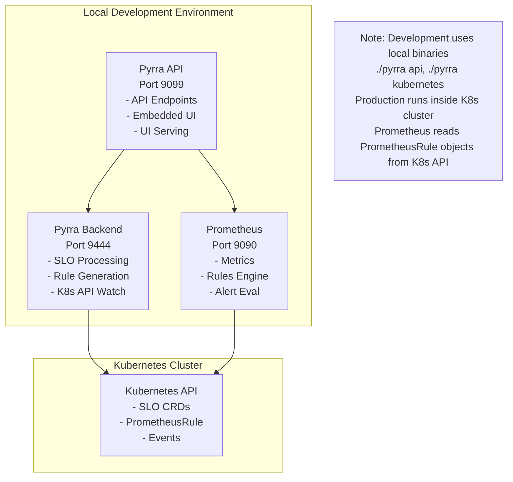
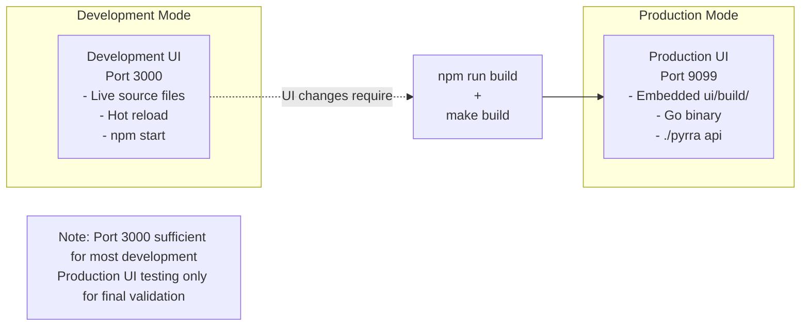

# Dynamic Burn Rate Feature Completion - Design Document

## Overview

This design document outlines the completion of the dynamic burn rate feature for Pyrra, focusing on comprehensive validation across all indicator types, enhanced user experience, and production readiness. The feature is approximately 30% complete with backend implementation finished and basic UI functionality working for ratio indicators.

The design leverages the comprehensive testing framework and quality standards already established in the project, organizing the remaining work into focused implementation tasks.

## Architecture

### Current Implementation Status

#### Completed Components ✅
- **Backend Implementation**: Complete for all indicator types (Ratio, Latency, LatencyNative, BoolGauge)
- **Mathematical Foundation**: Traffic-aware formula `(N_SLO / N_alert) × E_budget_percent × (1 - SLO_target)` validated
- **API Integration**: Full protobuf transmission with `burnRateType` field
- **Basic UI**: Badge system, threshold display for ratio indicators, tooltip framework
- **Testing Infrastructure**: Comprehensive validation patterns established

#### Remaining Work 🚧
- **Indicator Type Coverage**: Latency indicators need comprehensive UI validation, LatencyNative and BoolGauge indicators need complete UI implementation
- **Edge Case Handling**: Missing metrics, insufficient data scenarios validation
- **Alert Firing Validation**: End-to-end alert pipeline testing with precision and recall validation
- **Production Polish**: Enhanced tooltips, performance optimization
- **Comprehensive Testing**: Full regression testing and production readiness validation

### System Architecture

#### Multi-Service Local Development Architecture



#### UI Architecture - Dual-Mode Design



## Components and Interfaces

### Task-Based Development Framework

#### Task Group 1: Latency UI Completion (HIGH PRIORITY)
**Purpose**: Complete comprehensive validation of latency indicators
**Dependencies**: Basic latency threshold display working
**Deliverables**: 
- Enhanced tooltips with histogram-specific information
- Performance assessment vs ratio indicators
- Comprehensive error handling validation
- Production readiness documentation

#### Task Group 2: Resilience Testing (ALTERNATIVE PRIORITY)
**Purpose**: Validate edge case handling and missing metrics scenarios
**Dependencies**: None (can start immediately)
**Deliverables**:
- Missing metrics handling validation
- Mathematical edge case testing
- Error recovery behavior documentation
- Graceful degradation validation

#### Task Group 3: Additional Indicator Types
**Purpose**: Validate LatencyNative and BoolGauge indicators
**Dependencies**: Latency UI completion recommended
**Deliverables**:
- Complete indicator type coverage
- UI component support for all types
- Performance characteristics documentation

### UI Component Architecture

#### BurnRateThresholdDisplay Component Enhancement
```typescript
interface BurnRateThresholdDisplayProps {
  objective: Objective;
  factors: WindowFactor[];
  promClient: PrometheusService;
}

// Current Implementation Status:
// ✅ Ratio indicators: Working with calculated thresholds
// 🚧 Latency indicators: Basic functionality, needs enhancement
// 🔜 LatencyNative/BoolGauge: Not yet implemented
```

**Enhancement Strategy**:
1. **Indicator Type Detection**: Extend existing logic to handle all indicator types
2. **Metric Extraction**: Support histogram metrics (`_count`, `_bucket`) and boolean gauges
3. **Query Generation**: Generate appropriate Prometheus queries per indicator type
4. **Tooltip Enhancement**: Provide indicator-specific calculation details

#### Alerts Table Enhancement

**Table Column Updates**:
- **Static Case**: Keep existing "Factor" column showing values (14, 7, 2, 1)
- **Dynamic Case**: Rename column to "Error Budget %" showing values (1/48, 1/16, 1/14, 1/7)

**Tooltip Enhancement**:
```typescript
// Current (from ui/src/burnrate.tsx):
"Dynamic threshold adapts to traffic volume. Higher traffic = higher thresholds, 
lower traffic = lower thresholds. Formula: (N_SLO / N_long) × E_budget_percent × (1 - SLO_target)"

// Target: Enhanced with traffic context and static comparison
"Dynamic threshold adapts to traffic volume. 
Traffic ratio: 12.14x (5x above average for this window)
Dynamic threshold: 0.0024 vs Static threshold: 0.012 (5x smaller due to high traffic)
Formula: (N_SLO / N_long) × E_budget_percent × (1 - SLO_target)"

// Keep existing static tooltip structure:
"Static threshold calculation: 14 × (1 - 0.95) = 0.7000"
```

**Enhancement Details**:
1. **Traffic Context**: Show if current traffic is above/below average for the alert window
2. **Static Comparison**: Display what the static threshold would be for comparison
3. **Ratio Explanation**: Help users understand why dynamic threshold differs from static

### Backend Integration Points

#### Recording Rules Architecture (Already Implemented)
```promql
# Example recording rules (periods scale with SLO window):
# For 30d SLO window:
<metric_name>:increase30d
<metric_name>:burnrate5m
<metric_name>:burnrate30m
<metric_name>:burnrate2h
<metric_name>:burnrate6h26m

# For 7d SLO window (scaled):
<metric_name>:increase7d
<metric_name>:burnrate1m15s
<metric_name>:burnrate7m30s
# ... (periods automatically scaled)

# Dynamic Alert Expressions
(error_rate > ((N_SLO / N_alert) × E_budget_percent × (1 - SLO_target)))
```

#### CRD Integration (Already Implemented)
```yaml
apiVersion: pyrra.dev/v1alpha1
kind: ServiceLevelObjective
spec:
  burnRateType: dynamic  # Enables traffic-aware alerting
  # ... rest of SLO configuration
```

## Data Models

### Implementation Progress Tracking
```yaml
# Current Status Model
completed_work:
  - "Backend implementation and API integration"
  - "Basic UI threshold display (ratio indicators)"
  - "Latency backend validation and mathematical verification"
  - "Basic latency threshold display"
  
pending_work:
  - "Latency comprehensive validation (HIGH PRIORITY)"
  - "Missing metrics validation (ALTERNATIVE PRIORITY)"
  - "LatencyNative and BoolGauge validation"
  - "Alert firing validation"
  - "UI polish and production readiness"
  - "Comprehensive regression testing"

completion_percentage: ~30%  # Basic UI working for ratio and latency
production_ready: false      # Comprehensive testing required
```

### Quality Standards Model
```yaml
# AI_DEVELOPMENT_QUALITY_STANDARDS.md Compliance
quality_gates:
  systematic_comparison: required
  comprehensive_validation: required
  syntax_verification: required
  issue_documentation: required
  
validation_approach:
  - "Never analyze in isolation"
  - "Always compare with working examples"
  - "Question every difference"
  - "Test before declaring success"
  - "Document all issues immediately"
```

### Testing Data Model
```yaml
# Test Environment Configuration
test_slos:
  ratio_dynamic: "test-dynamic-apiserver"     # ✅ Working
  ratio_static: "test-static-apiserver"       # ✅ Working  
  latency_dynamic: "test-latency-dynamic"     # 🚧 Basic functionality
  
metrics:
  ratio_source: "apiserver_request_total"     # Rich error data (71 series)
  latency_source: "prometheus_http_request_duration_seconds"  # Histogram data
  
mathematical_validation:
  approach: "python -c '...' commands"       # NO LLM math calculations
  cross_validation: "Prometheus UI queries"
  tolerance: "Small discrepancies due to live data acceptable"
```

## Error Handling

### Graceful Degradation Strategy

#### Missing Metrics Scenarios
1. **Completely Non-Existent Metrics**: 
   - Backend: Generate rules without blocking other SLOs
   - UI: Display meaningful error state, not crashes
   - API: Return consistent error information

2. **Metrics Exist but No Data**:
   - Prometheus: Queries execute but return empty results
   - UI: Show appropriate fallback ("Traffic-Aware" or error message)
   - Mathematical: Prevent division by zero errors

3. **Insufficient Historical Data**:
   - Short-lived environments with minimal metric history
   - Conservative fallback calculations
   - Clear communication of data limitations

#### UI Error States
```typescript
// Error Handling Hierarchy
1. Loading State: "Calculating thresholds..."
2. Fallback State: "Traffic-Aware" (when calculation fails)
3. Error State: "Unable to calculate (see console)" 
4. Debug Information: Detailed errors in browser console
```

### Performance Error Handling

#### Query Timeout Management
- **Timeout Limits**: Reasonable query execution limits (5-10 seconds)
- **Retry Logic**: Automatic retry for transient failures
- **Fallback Display**: Graceful degradation when queries fail
- **Performance Monitoring**: Track query performance across indicator types

#### Resource Constraint Handling
- **Memory Management**: Efficient query result processing
- **Network Optimization**: Minimize API calls through caching
- **UI Responsiveness**: Non-blocking threshold calculations
- **Prometheus Load**: Monitor impact on Prometheus performance

## Testing Strategy

### Comprehensive Validation Framework

#### Phase 1: Indicator Type Coverage (Sessions 10C, 11)
**Objective**: Validate all SLO indicator types work correctly with dynamic burn rates

**Testing Matrix**:
```
Indicator Type    | Backend | Basic UI | Enhanced UI | Edge Cases
------------------|---------|----------|-------------|------------
Ratio            | ✅      | ✅       | ✅          | ✅
Latency          | ✅      | ✅       | 🚧          | 🔜
LatencyNative    | ✅      | 🔜       | 🔜          | 🔜
BoolGauge        | ✅      | 🔜       | 🔜          | 🔜
```

**Success Criteria**:
- All indicator types display calculated thresholds (not "Traffic-Aware")
- Mathematical accuracy validated with real Prometheus data
- Performance acceptable compared to static SLOs
- Consistent user experience across indicator types

#### Phase 2: Resilience Testing (Session 12)
**Objective**: Validate robust error handling and edge case scenarios

**Test Scenarios**:
1. **Missing Metrics**: Deploy SLOs with non-existent metrics
2. **Empty Data**: Use real metrics with selectors returning no data
3. **Mathematical Edge Cases**: Test division by zero, extreme ratios
4. **Recovery Behavior**: Validate system recovery when metrics become available

**Validation Approach**:
- **Parallel Testing**: Create both static and dynamic versions of problematic SLOs
- **System Monitoring**: Watch logs, performance, overall system health
- **Documentation**: Capture all discovered failure modes and handling strategies

#### Phase 3: Alert Firing Validation (Session 13)
**Objective**: Prove alerts actually fire correctly with both precision and recall

**Testing Framework**:
1. **Synthetic Metrics**: Generate controlled error conditions using Prometheus client
2. **Threshold Crossing**: Create traffic patterns that exceed calculated thresholds
3. **Alert Manager Integration**: Validate alerts appear in AlertManager UI
4. **Precision Testing**: Ensure alerts don't fire when they shouldn't
5. **Recall Testing**: Ensure alerts fire when they should

**Success Criteria**:
- Dynamic alerts demonstrate improved sensitivity AND specificity vs static
- End-to-end alert pipeline functions correctly
- Alert timing matches expected sensitivity levels

### Quality Assurance Framework

#### Systematic Comparison Methodology
**Reference**: AI_DEVELOPMENT_QUALITY_STANDARDS.md

1. **Comparison Tables**: Create detailed feature parity matrices
2. **Question Every Difference**: Explain all deviations from working examples
3. **Comprehensive Structure Validation**: Verify all expected components present
4. **Syntax Verification**: Test every generated query in Prometheus UI
5. **Issue Documentation**: Categorize and document all discovered problems

#### Mathematical Validation Standards
```bash
# Established Testing Pattern (NO LLM Math)
python -c "
n_slo = <extracted_value>
n_long = <extracted_value>
traffic_ratio = n_slo / n_long
e_budget_percent = 0.020833  # factor 14
slo_target = 0.95
threshold = traffic_ratio * e_budget_percent * (1 - slo_target)
print(f'Expected threshold: {threshold:.12f}')
"

# Cross-validation with Prometheus
curl -s "http://localhost:9090/api/v1/query?query=..." | jq '.data.result[0].value[1]'
```

## Implementation Roadmap

### Immediate Priorities (Next Implementation Phase)

#### Option A: Complete Latency Validation
**Rationale**: Build on existing foundation, complete most common indicator type after ratio
**Scope**: Enhanced tooltips, performance assessment, comprehensive validation
**Risk**: Medium complexity, building on working foundation
**Timeline**: 2-3 hours focused development + testing

#### Option B: Resilience Testing First
**Rationale**: Critical for production reliability, independent of indicator types
**Scope**: Missing metrics, edge cases, error handling validation
**Risk**: Lower complexity, easier debugging
**Timeline**: 1-2 hours focused testing

### Medium-Term Goals

1. **Complete Indicator Coverage**:
   - LatencyNative and BoolGauge indicator validation
   - UI component support for all indicator types
   - Performance characteristics documentation

2. **Alert Firing Validation**:
   - End-to-end alert pipeline testing
   - Synthetic metric generation for controlled testing
   - Precision and recall validation

3. **Production Polish**:
   - Enhanced tooltips with minimal required changes
   - Performance optimization and benchmarking
   - Final production readiness assessment

4. **Comprehensive Testing**:
   - Full regression testing across all indicator types
   - Production environment validation
   - Migration and deployment guide validation

### Success Metrics

#### Completion Tracking
- **Current**: ~30% complete (basic UI working for ratio and latency indicators)
- **Target**: 100% production ready
- **Estimated Remaining**: 3-5 focused sessions

#### Quality Gates
- **Feature Parity**: All indicator types have identical user experience
- **Performance**: Acceptable query performance at scale
- **Reliability**: Robust error handling for all edge cases
- **Documentation**: Comprehensive troubleshooting and deployment guides

#### Production Readiness Criteria
- **End-to-End Validation**: Complete testing in production-like environments
- **Migration Guides**: Clear instructions for converting static to dynamic SLOs
- **Performance Benchmarks**: Established performance expectations
- **Upstream Contribution**: Ready for pull request with comprehensive testing evidence

This design provides a clear roadmap for completing the dynamic burn rate feature while maintaining the high quality standards established in the project's comprehensive documentation and testing framework.