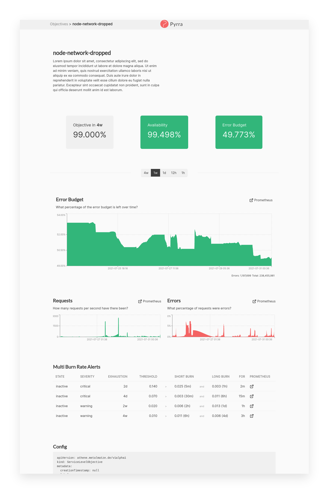
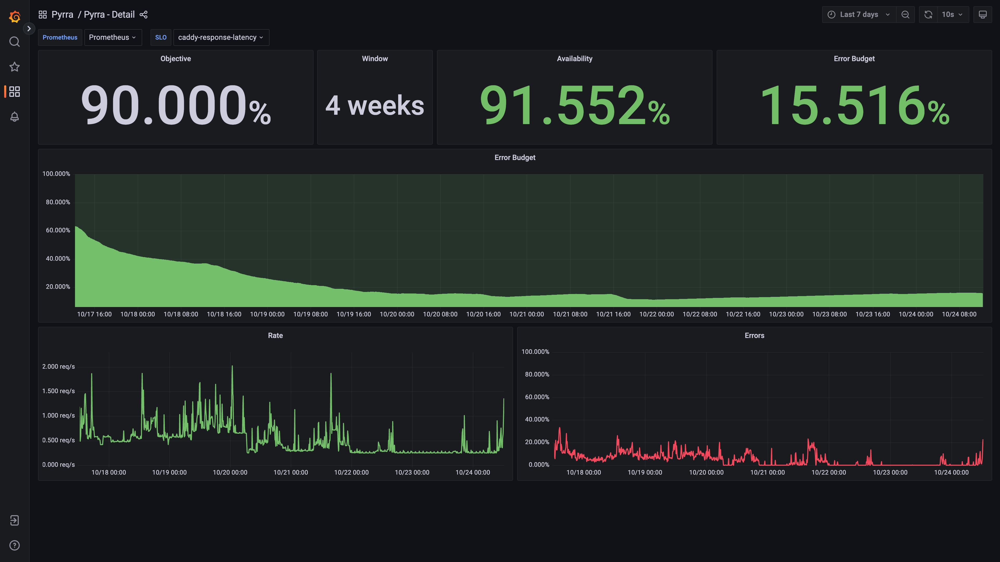
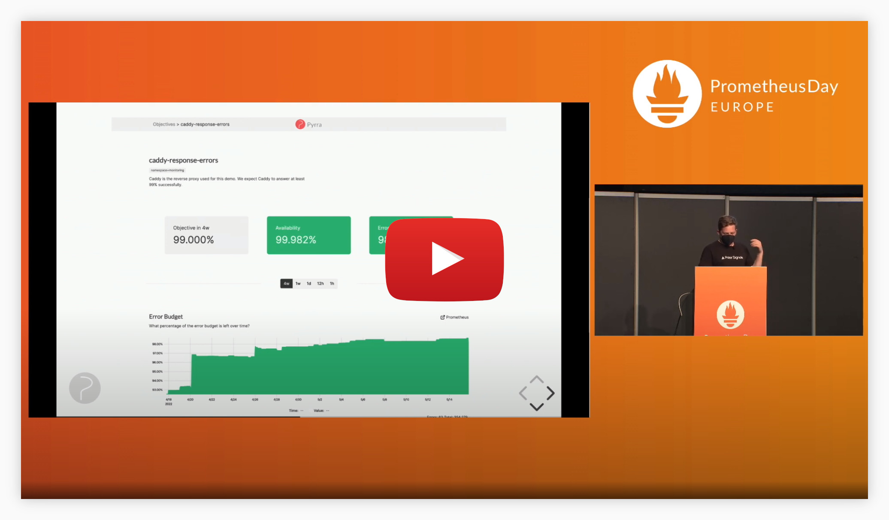
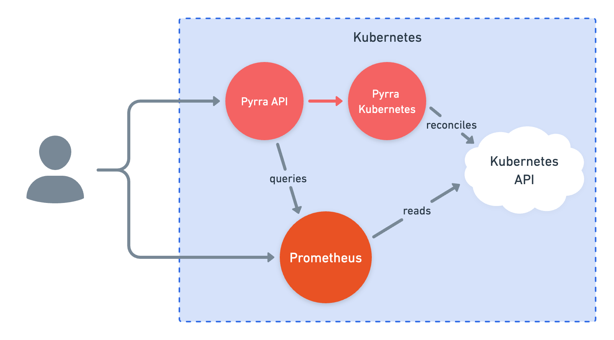
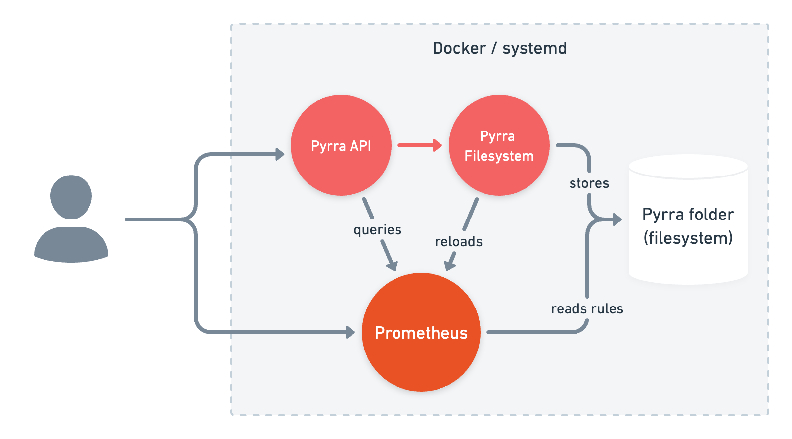

<p align="center">
  
</p>

<p align="center">Making SLOs with Prometheus manageable, accessible, and easy to use for everyone!
</p>
<p align="center"></p>

<p align="center"><a href="https://github.com/pyrra-dev/pyrra/tree/main/examples/grafana">Dashboards</a> to visualize SLOs in Grafana:</p>

<p align="center"></p>

<p align="center">Watch the 5min lightning talk at Prometheus Day 2022:</p>
<p align="center">
  <a href="https://www.youtube.com/watch?v=8Ox0M6HIE3w">
    
  </a>
</p>

## Features

- Support for Kubernetes, Docker, and filesystem
- Alerting: Generates 4 Multi Burn Rate Alerts with different severity
- Page listing all Service Level Objectives
  - All columns sortable
  - Sorted by remaining error budget to see the worst ones quickly
  - Clicking on labels to filter SLOs that contain the label  
  - Tool-tips when hovering for extra context
- Page with details for a Service Level Objective
  - Objective, Availability, Error Budget highlighted as 3 most important numbers
  - Graph to see how the error budget develops over time
  - Time range picker to change graphs
  - Request, Errors, Duration (RED) graphs for the underlying service
  - Multi Burn Rate Alerts overview table
- Caching of Prometheus query results
- Thanos: Disabling of partial responses and downsampling to 5m and 1h
- connect-go and connect-web generate protobuf APIs
- Grafana dashboard via `--generic-rules` generation

## Feedback & Support

If you have any feedback, please open a discussion in the GitHub Discussions of this project.  
We would love to learn what you think!

## Demo

Check out our live demo on [demo.pyrra.dev](https://demo.pyrra.dev)!  
Grafana dashboards are available as demo on [demo.pyrra.dev/grafana](https://demo.pyrra.dev/grafana/d/ccssRIenz/pyrra-detail?orgId=1&refresh=10s&from=now-7d&to=now)!

Feel free to give it a try there!

## How It Works

There are three components of Pyrra, all of which work through a single binary:

- The UI displays SLOs, error budgets, burn rates, etc.
- The API delivers information about SLOs from a backend (like Kubernetes) to the UI.
- A backend watches for new SLO objects and then creates Prometheus recording rules for each.
  - For Kubernetes, there is a Kubernetes Operator available
  - For everything else, there is a filesystem-based Operator available

For the backend/operator to do its magic, an SLO object has to be provided in
YAML-format:

```yaml
apiVersion: pyrra.dev/v1alpha1
kind: ServiceLevelObjective
metadata:
  name: pyrra-api-errors
  namespace: monitoring
  labels:
    prometheus: k8s
    role: alert-rules
    pyrra.dev/team: operations # Any labels prefixed with 'pyrra.dev/' will be propagated as Prometheus labels, while stripping the prefix.
spec:
  target: "99"
  window: 2w
  description: Pyrra's API requests and response errors over time grouped by route.
  indicator:
    ratio:
      errors:
        metric: http_requests_total{job="pyrra",code=~"5.."}
      total:
        metric: http_requests_total{job="pyrra"}
      grouping:
        - route
```

Depending on your mode of operation, this information is provided through an
object in Kubernetes, or read from a static file.

In order to calculate error budget burn rates, Pyrra will then proceed to create
[Prometheus recording rules](https://prometheus.io/docs/prometheus/latest/configuration/recording_rules/#recording-rules)
for each SLO.

The following rules would be created for the above example:

```
http_requests:increase2w
http_requests:burnrate3m
http_requests:burnrate15m
http_requests:burnrate30m
http_requests:burnrate1h
http_requests:burnrate3h
http_requests:burnrate12h
http_requests:burnrate2d
```

The recording rules names are based on the originally provided metric.
The recording rules contain the necessary labels to uniquely identify the recording rules in case there are multiple ones available.

### Running inside a Kubernetes cluster

> An example for this mode of operation can be found in [examples/kubernetes](examples/kubernetes).



Here two deployments are needed: one for the API / UI and one for the
operator. For the first deployment, start the binary with the `api` argument.

When starting the binary with the `kubernetes` argument, the service will watch
the apiserver for `ServiceLevelObjectives`. Once a new SLO is picked up,
Pyrra will create [PrometheusRule](https://prometheus-operator.dev/docs/operator/design/#prometheusrule)
objects that are automatically picked up by the [Prometheus Operator](https://prometheus-operator.dev).

If you're unable to run the Prometheus Operator inside your cluster, you can add
the `--config-map-mode=true` flag after the `kubernetes` argument. This will
save each recording rule in a separate `ConfigMap`.

#### Install with Helm

Thanks to [@rlex](https://github.com/rlex) there is a [Helm chart](https://artifacthub.io/packages/helm/rlex/pyrra) for deploying Pyrra too. 

### Running inside Docker / Filesystem

> An example for this mode of operation can be found in [examples/docker-compose](examples/docker-compose).



You can easily start Pyrra on its own via the provided Docker image:

```bash
docker pull ghcr.io/pyrra-dev/pyrra:v0.6.1
```

When running Pyrra outside of Kubernetes, the SLO object can be provided through
a YAML file read from the file system. For this, one container or binary needs to
be started with the `api` argument and the reconciler with the `filesystem`
argument.

Here, Pyrra will save the generated recording rules to disk where they can be
picked up by a Prometheus instance. While running Pyrra on its own works, there
won't be any SLO configured, nor will there be any data from a Prometheus to
work with. It's designed to work alongside a Prometheus.

## Tech Stack

**Client:** TypeScript with React, Bootstrap, and uPlot.

**Server:** Go with libraries such as: chi, ristretto, xxhash, client-go.

Generated protobuf APIs with connect-go for Go and connect-web for TypeScript. 

## Roadmap

Best to check the [Projects board](https://github.com/pyrra-dev/pyrra/projects) and if you cannot find what you're looking for feel free to open an issue!

## Contributing

Contributions are always welcome!

See [CONTRIBUTING.md](CONTRIBUTING.md) for ways to get started.

Please adhere to this project's `code of conduct`.

## Maintainers

| Name           | Area        | GitHub                                             | Twitter                                             | Company       |
| :------------- | :---------- | :------------------------------------------------- | :-------------------------------------------------- | :------------ |
| Nadine Vehling | UX/UI       | [@nadinevehling](https://github.com/nadinevehling) | [@nadinevehling](https://twitter.com/nadinevehling) | Grafana Labs  |
| Matthias Loibl | Engineering | [@metalmatze](https://github.com/metalmatze)       | [@metalmatze](https://twitter.com/MetalMatze)       | Polar Signals |

We are mostly maintaining Pyrra in our free time.

## Acknowledgements

[@aditya-konarde](https://github.com/aditya-konarde),
[@brancz](https://github.com/brancz),
[@cbrgm](https://github.com/cbrgm),
[@codesome](https://github.com/codesome),
[@ekeih](https://github.com/ekeih),
[@guusvw](https://github.com/guusvw),
[@jzelinskie](https://github.com/jzelinskie),
[@kakkoyun](https://github.com/kakkoyun),
[@lilic](https://github.com/lilic),
[@markusressel](https://github.com/markusressel),
[@morremeyer](https://github.com/morremeyer),
[@mxinden](https://github.com/mxinden),
[@numbleroot](https://github.com/numbleroot),
[@paulfantom](https://github.com/paulfantom),
[@RiRa12621](https://github.com/RiRa12621),
[@tboerger](https://github.com/tboerger),
and Maria Franke.

While we were working on Pyrra in private these amazing people helped us with a look of feedback and some even took an extra hour for a in-depth testing! Thank you all so much!

Additionally, [@metalmatze](https://github.com/metalmatze) would like to thank [Polar Signals](https://www.polarsignals.com/) for allowing us to work on this project in his 20% time.

## FAQ

#### Why not use Grafana in this particular use case?

Right now we could have used Grafana indeed. In upcoming releases, we plan to add more interactive features to give you better context when coming up with new SLOs. This is something we couldn't do with Grafana.

#### Do I still need Grafana?

Yes, Grafana is an amazing data visualization tool for Prometheus metrics. You can create your own custom dashboards and dive a lot deeper into each component while debugging.

#### Does it work with Thanos too?

Yes, in fact I've been developing this against my little Thanos cluster most of the time.  
The queries even dynamically add headers for downsampling and disable partial responses.

#### How many instances should I deploy?

It depends on the topology of your infrastructure, however, we think that alerting should still happen within each individual Prometheus and therefore running one instance with one Prometheus (pair) makes the most sense. Pyrra itself only needs one instance per Prometheus (pair).

#### Why don't you support more complex SLOs?

For now, we try to accomplish an easy-to-setup workflow for the most common SLOs.
It is still possible to write these more complex SLOs manually and deploy them to Prometheus along those generated.
You can base more complex SLOs on the output of one SLO from this tool.

#### Why is the objective target a string not a float?

[Kubebuilder doesn't support floats in CRDs](https://github.com/kubernetes-sigs/controller-tools/issues/245)...  
Therefore, we need to pass it as string and internally convert it from string to float64.

## Related

Here are some related projects:

- [slok/sloth](https://github.com/slok/sloth)
- [metalmatze/slo-libsonnet](https://github.com/metalmatze/slo-libsonnet)
