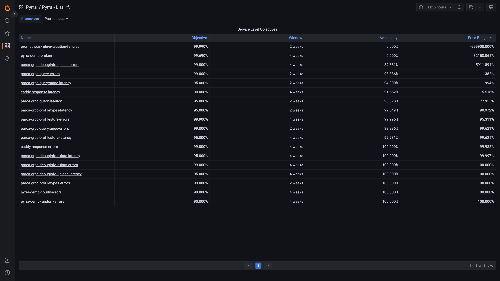

# Pyrra Grafana Dashboards

## Live Demo

We host a live demo of these dashboards on [demo.pyrra.dev/grafana](https://demo.pyrra.dev/grafana/d/ccssRIenz/pyrra-detail?orgId=1&refresh=10s&from=now-7d&to=now).

## Installation 

Let's discuss how you can install the Pyrra Grafana dashboards.

### Generic Rules

Pyrra supports generic recording rules.
It means that Pyrra generates metrics with the same name for each SLO.
```
pyrra_objective
pyrra_window
pyrra_availability
pyrra_requests_total
pyrra_errors_total
```

The Grafana dashboards rely on these recording rules. You need to enabled generating these on the `filesystem` or `kubernetes` component.
Run these components with the `--generic-rules` flag. 

Please note that the `grouping` feature is not supported when using generic rules. 
This is a limitation with the Grafana dashboard dropdowns (they would need to be dynamic).

### Import the JSON files

That that the Prometheus gets configured to generate the generic rules Grafana dashboards can make use of them.
Download the `list.json` and `detail.json` files and import them into your Grafana instance (next to creating new dashboards).
Make sure to keep the IDs of the dashboards so linking from the List to the Detail dashboard still works. 

## Dashboards

The List dashboard shows and overview of all your SLOs. 
It's similar to the Pyrra list and shows metrics like the availability and remaining error budget.
You can click on the names of each SLO to take you to the detail page with the SLO pre-selected.



The detail dashboards shows you an individual SLO. All necessary and important metrics are shown.
Use the dropdown to select other SLOs.


